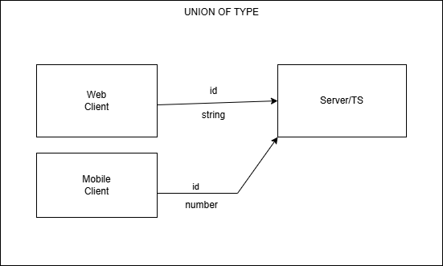

## Union of Type

## Task
1. Setup a new TS React project using vite
2. Make two components
   - Tile (parent) : The tile component will be having Name as a child
   - Name (child) : Name component takes a prop called as `title` which will be passed from the parent which will be the text you need to display in the Name component.
3. Create the above two components and see if you face any TS compiler warnings ???
4. Write a component that has a input tag which will take an onChange handler from the parent and whenever you type anything on the input tag it should technically emit an event and the onChange handler should be executed